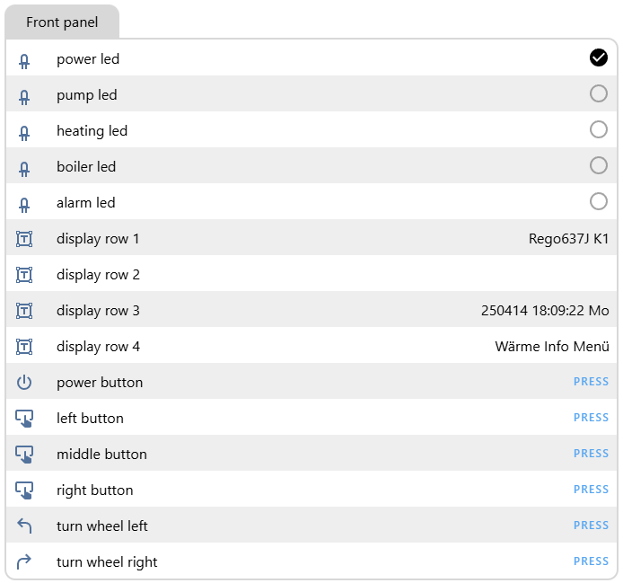
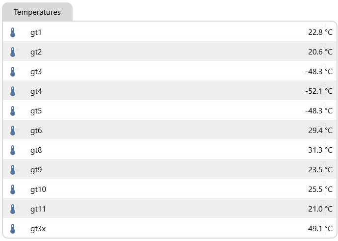
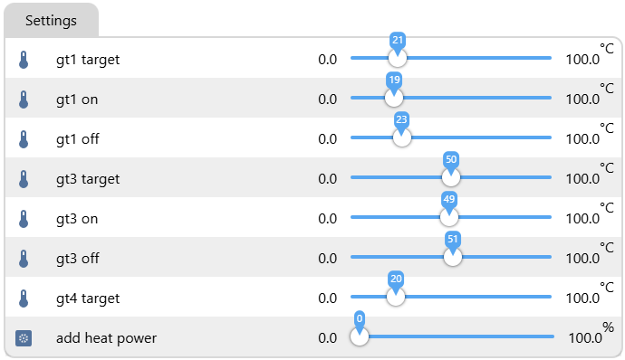

# IVT Rego6xx Control <!-- omit in toc -->

A REST API server and MQTT client which provides control over IVT heatpumps, which uses a Rego6xx controller.
Its the successor project of [Rego6xxSrv](https://github.com/BlueAndi/Rego6xxSrv). Homeassistant MQTT automatic device discovery is supported as well.

[](http://choosealicense.com/licenses/mit/)
[](https://www.repostatus.org/#active)
[](https://github.com/BlueAndi/IVTRego6xxControl/releases)

- [Motivation](#motivation)
- [Hardware](#hardware)
- [Deployment](#deployment)
- [Software](#software)
  - [Installation](#installation)
  - [Build](#build)
  - [Flash to target and monitor](#flash-to-target-and-monitor)
  - [Usage](#usage)
- [Sensors](#sensors)
- [Binary Sensors](#binary-sensors)
- [Text Sensors](#text-sensors)
- [Buttons](#buttons)
- [Numbers](#numbers)
- [API Endpoints and MQTT Topics](#api-endpoints-and-mqtt-topics)
- [SW-Architecture](#sw-architecture)
- [Details](#details)
  - [Command IDs](#command-ids)
  - [System Register Addresses](#system-register-addresses)
    - [Settings](#settings)
    - [Control Data](#control-data)
    - [Device Values](#device-values)
    - [Temperature Sensor Values](#temperature-sensor-values)
    - [Front Panel LED and Button Addresses](#front-panel-led-and-button-addresses)
- [Used Libraries](#used-libraries)
- [Issues, Ideas And Bugs](#issues-ideas-and-bugs)
- [License](#license)
- [Contribution](#contribution)

## Motivation

Unfortunately my Junkers heatpump (original build by IVT) has no smart interface out of the box. Therefore the service interface of the build-in rego6xx controller shall be used to read sensor data or to modify temperature threshold and etc.

The first adapter I created was the [Rego6xxSrv](https://github.com/BlueAndi/Rego6xxSrv) based on a ATmega644P, which is still up and running. But meanwhile the ATmega644P board I used is obsolete since 2024-01-01 and regarding my ideas the resources are very limited. Therefore the decision was made to create a secon adapter with less resource constraints and easier integration into a home automation.

The protocol for the Rego6xx controller was original derived from [http://rago600.sourceforge.net/](http://rago600.sourceforge.net/).





## Hardware

The [Olimex ESP32-POE-ISO](https://www.olimex.com/Products/IoT/ESP32/ESP32-POE-ISO/open-source-hardware) board with the RS-232 level shifter [Olimex MOD-RS232](https://www.olimex.com/Products/Modules/Interface/MOD-RS232/open-source-hardware) is used.


## Deployment


## Software

ESPHome is used as the base of the software. The IVT reg6xx controller is implemented like a custom component.

### Installation

1. Install Python.
2. Setup [virtual environment](https://docs.python.org/3/library/venv.html).

    ```bash
    python -m venv .venv
    ```

3. Activate virtual environment.
   - Windows CMD: ```.venv\Scripts\activate.bat```
   - Windows PowerShell: ```.venv\Scripts\activate.ps1```
   - Linux: ```.venv/Scripts/activate```
4. Install packages.

    ```bash
    pip install -r requirements.txt
    ```

5. Create a ```secrets.yaml``` in the project root folder. Replace **my_user** and **my_password** according to the MQTT broker credentials.

    ```yaml
    mqtt_broker: my_broker_url
    mqtt_user: my_user
    mqtt_password: my_password
    ```

### Build

```bash
esphome compile IVTRego6xxCtrl.yaml
```

### Flash to target and monitor

```bash
esphome run IVTRego6xxCtrl.yaml
```

### Usage

## Sensors

| **Name**   | **Description**                | **Command ID** | **Rego600-635**<br>**System Register Address** | **Rego636-...**<br>**System Register Address** | **Value**               |
|------------|--------------------------------|----------------|------------------------------------------------|------------------------------------------------|-------------------------|
| **gt1**    | Radiator return temperature    | 0x02           | 0x0209                                         | 0x020B                                         | Signed 16-bit in 0.1 °C |
| **gt2**    | Outdoor temperature            | 0x02           | 0x020A                                         | 0x020C                                         | Signed 16-bit in 0.1 °C |
| **gt3**    | Hot water temperature          | 0x02           | 0x020B                                         | 0x020D                                         | Signed 16-bit in 0.1 °C |
| **gt4**    | Forward temperature            | 0x02           | 0x020C                                         | 0x020E                                         | Signed 16-bit in 0.1 °C |
| **gt5**    | Room temperature               | 0x02           | 0x020D                                         | 0x020F                                         | Signed 16-bit in 0.1 °C |
| **gt6**    | Compressor temperature         | 0x02           | 0x020E                                         | 0x0210                                         | Signed 16-bit in 0.1 °C |
| **gt8**    | Heat fluid out temperature     | 0x02           | 0x020F                                         | 0x0211                                         | Signed 16-bit in 0.1 °C |
| **gt9**    | Heat fluid in temperature      | 0x02           | 0x0210                                         | 0x0212                                         | Signed 16-bit in 0.1 °C |
| **gt10**   | Cold fluid in temperature      | 0x02           | 0x0211                                         | 0x0213                                         | Signed 16-bit in 0.1 °C |
| **gt11**   | Cold fluid out temperature     | 0x02           | 0x0212                                         | 0x0214                                         | Signed 16-bit in 0.1 °C |
| **gt3X**   | External hot water temperature | 0x02           | 0x0213                                         | 0x0215                                         | Signed 16-bit in 0.1 °C |

## Binary Sensors

| **Name**   | **Description** | **Command ID** | **Rego600-635**<br>**System Register Address** | **Rego636-...**<br>**System Register Address** | **Value**    |
|------------|-----------------|----------------|------------------------------------------------|------------------------------------------------|--------------|
| **power**  | Power           | 0x00           | 0x0012                                         | 0x0012                                         | 0: off 1: on |
| **pump**   | Pump            | 0x00           | 0x0013                                         | 0x0013                                         | 0: off 1: on |
| **heating**| Heating         | 0x00           | 0x0014                                         | 0x0014                                         | 0: off 1: on |
| **boiler** | Boiler          | 0x00           | 0x0015                                         | 0x0015                                         | 0: off 1: on |
| **alarm**  | Alarm           | 0x00           | 0x0016                                         | 0x0016                                         | 0: off 1: on |

## Text Sensors

| **Name**          | **Description** | **Command ID** | **Rego600-635**<br>**System Register Address** | **Rego636-...**<br>**System Register Address** | **Value**              |
|-------------------|-----------------|----------------|------------------------------------------------|------------------------------------------------|------------------------|
| **display_row_1** | Display row 1   | 0x20           | 0x0000                                         | 0x0000                                         | '\0' terminated string |
| **display_row_2** | Display row 2   | 0x20           | 0x0001                                         | 0x0001                                         | '\0' terminated string |
| **display_row_3** | Display row 3   | 0x20           | 0x0002                                         | 0x0002                                         | '\0' terminated string |
| **display_row_4** | Display row 4   | 0x20           | 0x0003                                         | 0x0003                                         | '\0' terminated string |

## Buttons

| **Name**            | **Description**   | **Command ID** | **Rego600-635**<br>**System Register Address** | **Rego636-...**<br>**System Register Address** | **Value**  |
|---------------------|-------------------|----------------|------------------------------------------------|------------------------------------------------|------------|
| **power_button**    | Power button      | 0x01           | 0x0008                                         | 0x0008                                         | 1: pressed |
| **left_button**     | Left button       | 0x01           | 0x0009                                         | 0x0009                                         | 1: pressed |
| **middle_button**   | Middle button     | 0x01           | 0x000A                                         | 0x000A                                         | 1: pressed |
| **right_button**    | Right button      | 0x01           | 0x000B                                         | 0x000B                                         | 1: pressed |
| **turn_wheel_left** | Turn wheel left   | 0x01           | 0x0044                                         | 0x0044                                         | 0x1FFFFF   |
| **turn_wheel_right**| Turn wheel right  | 0x01           | 0x0044                                         | 0x0044                                         | 0x000001   |

## Numbers

| **Name**           | **Description**                 | **Command ID**    | **Rego600-635**<br>**System Register Address** | **Rego636-...**<br>**System Register Address** | **Value**               |
|--------------------|---------------------------------|-------------------|------------------------------------------------|------------------------------------------------|-------------------------|
| **gt1_target**     | GT1 target temperature          | 0x02 / 0x03       | 0x006E                                         | 0x006E                                         | Signed 16-bit in 0.1 °C |
| **gt1_on**         | GT1 on temperature threshold    | 0x02 / 0x03       | 0x006F                                         | 0x006F                                         | Signed 16-bit in 0.1 °C |
| **gt1_off**        | GT1 off temperature threshold   | 0x02 / 0x03       | 0x0070                                         | 0x0070                                         | Signed 16-bit in 0.1 °C |
| **gt3_target**     | GT3 target temperature          | 0x02 / 0x03       | 0x002B                                         | 0x002B                                         | Signed 16-bit in 0.1 °C |
| **gt3_on**         | GT3 on temperature threshold    | 0x02 / 0x03       | 0x0073                                         | 0x0073                                         | Signed 16-bit in 0.1 °C |
| **gt3_off**        | GT3 off temperature threshold   | 0x02 / 0x03       | 0x0074                                         | 0x0074                                         | Signed 16-bit in 0.1 °C |
| **gt4_target**     | GT4 target temperature          | 0x02 / 0x03       | 0x006D                                         | 0x006D                                         | Signed 16-bit in 0.1 °C |
| **add_heat_power** | Add heat power                  | 0x02 / 0x03       | 0x006C                                         | 0x006C                                         | Signed 16-bit in 0.1 %  |

## API Endpoints and MQTT Topics

| **Name**            | **Description**                | **REST API**                                   | **MQTT Topic**                                |
|---------------------|--------------------------------|------------------------------------------------|-----------------------------------------------|
| **gt1**             | Radiator return temperature    | `http://<IP-ADDRESS>/sensor/gt1`               | `heatpumpctrl/sensor/gt1/state`               |
| **gt2**             | Outdoor temperature            | `http://<IP-ADDRESS>/sensor/gt2`               | `heatpumpctrl/sensor/gt2/state`               |
| **gt3**             | Hot water temperature          | `http://<IP-ADDRESS>/sensor/gt3`               | `heatpumpctrl/sensor/gt3/state`               |
| **gt4**             | Forward temperature            | `http://<IP-ADDRESS>/sensor/gt4`               | `heatpumpctrl/sensor/gt4/state`               |
| **gt5**             | Room temperature               | `http://<IP-ADDRESS>/sensor/gt5`               | `heatpumpctrl/sensor/gt5/state`               |
| **gt6**             | Compressor temperature         | `http://<IP-ADDRESS>/sensor/gt6`               | `heatpumpctrl/sensor/gt6/state`               |
| **gt8**             | Heat fluid out temperature     | `http://<IP-ADDRESS>/sensor/gt8`               | `heatpumpctrl/sensor/gt8/state`               |
| **gt9**             | Heat fluid in temperature      | `http://<IP-ADDRESS>/sensor/gt9`               | `heatpumpctrl/sensor/gt9/state`               |
| **gt10**            | Cold fluid in temperature      | `http://<IP-ADDRESS>/sensor/gt10`              | `heatpumpctrl/sensor/gt10/state`              |
| **gt3X**            | External hot water temperature | `http://<IP-ADDRESS>/sensor/gt3x`              | `heatpumpctrl/sensor/gt3x/state`              |
| **power**           | Power                          | `http://<IP-ADDRESS>/binary_sensor/power`      | `heatpumpctrl/binary_sensor/power/state`      |
| **pump**            | Pump                           | `http://<IP-ADDRESS>/binary_sensor/pump`       | `heatpumpctrl/binary_sensor/pump/state`       |
| **heating**         | Heating                        | `http://<IP-ADDRESS>/binary_sensor/heating`    | `heatpumpctrl/binary_sensor/heating/state`    |
| **boiler**          | Boiler                         | `http://<IP-ADDRESS>/binary_sensor/boiler`     | `heatpumpctrl/binary_sensor/boiler/state`     |
| **alarm**           | Alarm                          | `http://<IP-ADDRESS>/binary_sensor/alarm`      | `heatpumpctrl/binary_sensor/alarm/state`      |
| **display_row_1**   | Display row 1                  | `http://<IP-ADDRESS>/text_sensor/display_row_1`| `heatpumpctrl/text_sensor/display_row_1/state`|
| **display_row_2**   | Display row 2                  | `http://<IP-ADDRESS>/text_sensor/display_row_2`| `heatpumpctrl/text_sensor/display_row_2/state`|
| **display_row_3**   | Display row 3                  | `http://<IP-ADDRESS>/text_sensor/display_row_3`| `heatpumpctrl/text_sensor/display_row_3/state`|
| **display_row_4**   | Display row 4                  | `http://<IP-ADDRESS>/text_sensor/display_row_4`| `heatpumpctrl/text_sensor/display_row_4/state`|
| **power_button**    | Power button                   | `http://<IP-ADDRESS>/button/power_button`      | `heatpumpctrl/button/power_button/state`      |
| **left_button**     | Left button                    | `http://<IP-ADDRESS>/button/left_button`       | `heatpumpctrl/button/left_button/state`       |
| **middle_button**   | Middle button                  | `http://<IP-ADDRESS>/button/middle_button`     | `heatpumpctrl/button/middle_button/state`     |
| **right_button**    | Right button                   | `http://<IP-ADDRESS>/button/right_button`      | `heatpumpctrl/button/right_button/state`      |
| **gt1_target**      | GT1 target temperature         | `http://<IP-ADDRESS>/number/gt1_target`        | `heatpumpctrl/number/gt1_target/state`        |
| **gt1_on**          | GT1 on temperature threshold   | `http://<IP-ADDRESS>/number/gt1_on`            | `heatpumpctrl/number/gt1_on/state`            |
| **gt1_off**         | GT1 off temperature threshold  | `http://<IP-ADDRESS>/number/gt1_off`           | `heatpumpctrl/number/gt1_off/state`           |
| **gt3_target**      | GT3 target temperature         | `http://<IP-ADDRESS>/number/gt3_target`        | `heatpumpctrl/number/gt3_target/state`        |
| **gt3_on**          | GT3 on temperature threshold   | `http://<IP-ADDRESS>/number/gt3_on`            | `heatpumpctrl/number/gt3_on/state`            |
| **gt3_off**         | GT3 off temperature threshold  | `http://<IP-ADDRESS>/number/gt3_off`           | `heatpumpctrl/number/gt3_off/state`           |
| **gt4_target**      | GT4 target temperature         | `http://<IP-ADDRESS>/number/gt4_target`        | `heatpumpctrl/number/gt4_target/state`        |
| **add_heat_power**  | Add heat power                 | `http://<IP-ADDRESS>/number/add_heat_power`    | `heatpumpctrl/number/add_heat_power/state`    |

## SW-Architecture


## Details

### Command IDs

| **Command ID** | **Description**                          |
|----------------|------------------------------------------|
| 0x00           | Read from front panel (register 0x093FF) |
| 0x01           | Write to front panel (register 0x09FF)   |
| 0x02           | Read system register (register 0x1345)   |
| 0x03           | Write system register (register 0x1345)  |
| 0x04           | Read timer register (register 0x1B45)    |
| 0x05           | Write timer register (register 0x1B45)   |
| 0x06           | Read register 1B61 (register 0x1B61)     |
| 0x07           | Write register 1B61 (register 0x1B61)    |
| 0x20           | Read display                             |
| 0x40           | Read last error line                     |
| 0x42           | Read previous error line                 |
| 0x7F           | Read REGO version                        |

### System Register Addresses

#### Settings

| **Rego600-635**<br>**System Register Address** | **Rego636-...**<br>**System Register Address** | **Description**                                |
|------------------------------------------------|------------------------------------------------|------------------------------------------------|
| 0x0000                                         | 0x0000                                         | Heat curve                                     |
| 0x0001                                         | 0x0001                                         | Heat curve fine adjustment                     |
| 0x0021                                         | 0x0021                                         | Indoor temperature settings                    |
| 0x0022                                         | 0x0022                                         | Curve influenced by indoor temperature         |
| 0x001E                                         | 0x001E                                         | Adjust curve at 20 degree outdoor temperature  |
| 0x001C                                         | 0x001C                                         | Adjust curve at 15 degree outdoor temperature  |
| 0x001A                                         | 0x001A                                         | Adjust curve at 10 degree outdoor temperature  |
| 0x0018                                         | 0x0018                                         | Adjust curve at 5 degree outdoor temperature   |
| 0x0016                                         | 0x0016                                         | Adjust curve at 0 degree outdoor temperature   |
| 0x0014                                         | 0x0014                                         | Adjust curve at -5 degree outdoor temperature  |
| 0x0012                                         | 0x0012                                         | Adjust curve at -10 degree outdoor temperature |
| 0x0010                                         | 0x0010                                         | Adjust curve at -15 degree outdoor temperature |
| 0x000E                                         | 0x000E                                         | Adjust curve at -20 degree outdoor temperature |
| 0x000C                                         | 0x000C                                         | Adjust curve at -25 degree outdoor temperature |
| 0x000A                                         | 0x000A                                         | Adjust curve at -30 degree outdoor temperature |
| 0x0008                                         | 0x0008                                         | Adjust curve at -35 degree outdoor temperature |
| 0x0002                                         | 0x0002                                         | Heat curve coupling difference                 |

#### Control Data

| **Rego600-635**<br>**System Register Address** | **Rego636-...**<br>**System Register Address** | **Description**                                |
|------------------------------------------------|------------------------------------------------|------------------------------------------------|
| 0x006E                                         | 0x006E                                         | GT1 target value                               |
| 0x006F                                         | 0x006F                                         | GT1 on value                                   |
| 0x0070                                         | 0x0070                                         | GT1 off value                                  |
| 0x002B                                         | 0x002B                                         | GT3 target value                               |
| 0x0073                                         | 0x0073                                         | GT3 on value                                   |
| 0x0074                                         | 0x0074                                         | GT3 off value                                  |
| 0x006D                                         | 0x006D                                         | GT4 target value                               |
| 0x006C                                         | 0x006C                                         | Additional heat power in percent               |

#### Device Values

| **Rego600-635**<br>**System Register Address** | **Rego636-...**<br>**System Register Address** | **Description**                                |
|------------------------------------------------|------------------------------------------------|------------------------------------------------|
| 0x01FD                                         | 0x01FF                                         | Ground loop pump P3                            |
| 0x01FE                                         | 0x0200                                         | Compressor                                     |
| 0x01FF                                         | 0x0201                                         | Additional heat 3KW                            |
| 0x0200                                         | 0x0202                                         | Additional heat 6KW                            |
| 0x0203                                         | 0x0205                                         | Radiator pump P1                               |
| 0x0204                                         | 0x0206                                         | Heat carrier pump P2                           |
| 0x0205                                         | 0x0207                                         | Tree-way valve VXV                             |
| 0x0206                                         | 0x0208                                         | Alarm                                          |

#### Temperature Sensor Values

| **Rego600-635**<br>**System Register Address** | **Rego636-...**<br>**System Register Address** | **Description**                                |
|------------------------------------------------|------------------------------------------------|------------------------------------------------|
| 0x0209                                         | 0x020B                                         | Radiator return GT1                            |
| 0x020A                                         | 0x020C                                         | Outdoor GT2                                    |
| 0x020B                                         | 0x020D                                         | Hot water GT3                                  |
| 0x020C                                         | 0x020E                                         | Forward GT4                                    |
| 0x020D                                         | 0x020F                                         | Room GT5                                       |
| 0x020E                                         | 0x0210                                         | Compressor GT6                                 |
| 0x020F                                         | 0x0211                                         | Heat fluid out GT8                             |
| 0x0210                                         | 0x0212                                         | Heat fluid in GT9                              |
| 0x0211                                         | 0x0213                                         | Cold fluid in GT10                             |
| 0x0212                                         | 0x0214                                         | Cold fluid out GT11                            |
| 0x0213                                         | 0x0215                                         | External hot water GT3X                        |

#### Front Panel LED and Button Addresses

| **Rego600-635**<br>**Address** | **Rego636-...**<br>**Address** | **Description**  |
|--------------------------------|--------------------------------|------------------|
| 0x0008                         | 0x0008                         | Power button     |
| 0x0009                         | 0x0009                         | Left button      |
| 0x000A                         | 0x000A                         | Middle button    |
| 0x000B                         | 0x000B                         | Right button     |
| 0x0012                         | 0x0012                         | Power LED        |
| 0x0013                         | 0x0013                         | Pump LED         |
| 0x0014                         | 0x0014                         | Heating LED      |
| 0x0015                         | 0x0015                         | Boiler LED       |
| 0x0016                         | 0x0016                         | Alarm LED        |
| 0x0044                         | 0x0044                         | Wheel            |

## Used Libraries

| Library | Description | License |
| - | - | - |
| [ESPHome](https://github.com/esphome/esphome) | ESPHome | MIT and GPLv3 |

## Issues, Ideas And Bugs

If you have further ideas or you found some bugs, great! Create a [issue](https://github.com/BlueAndi/IVTRego6xxControl/issues) or if you are able and willing to fix it by yourself, clone the repository and create a pull request.

## License

The whole source code is published under the [MIT license](http://choosealicense.com/licenses/mit/).
Consider the different licenses of the used third party libraries too!

## Contribution

Unless you explicitly state otherwise, any contribution intentionally submitted for inclusion in the work by you, shall be licensed as above, without any
additional terms or conditions.
